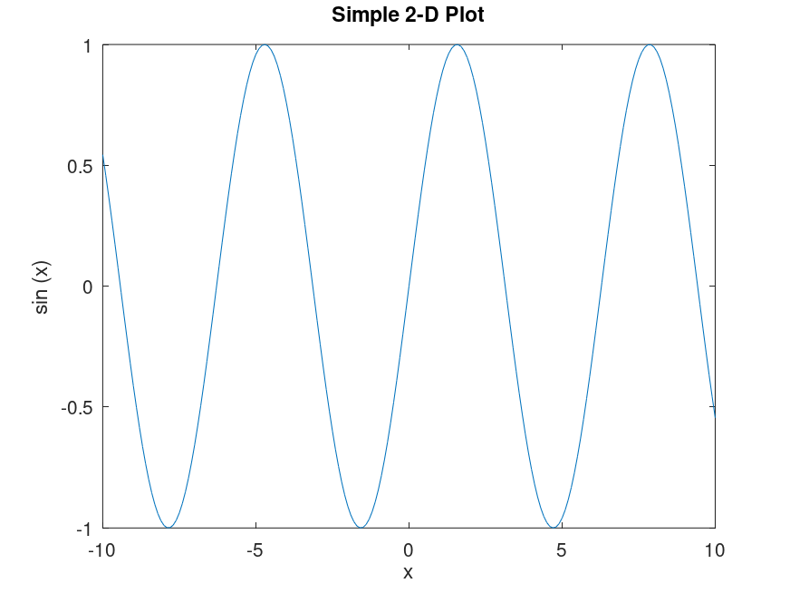

# Test

[00:00:01] rec_2026-04-06_09-32-21.m4a
[00:00:09] rec_2026-04-06_09-32-21.m4a
[00:00:11] rec_2026-04-06_09-32-21.m4a

 

天气晴朗的一天, 我正在食堂里坐着敲打键盘, 侧对着窗子，男生，穿着黑色衣服, 年轻阳光

天堂电影院

[00:00:02] rec_2026-04-07_17-18-01.m4a
![[00:00:02] rec_2026-04-07_17-18-01.m4a](/data/data/com.termux/files/home/Yu/db/silionflow/20260407_185057.png)
[00:00:05] rec_2026-04-07_17-18-01.m4a

我现在内心好开心，有思念的一个她, 生成黑白电影风格 😃

](/data/data/com.termux/files/home/Yu/db/silionflow/20260407_204517.png)

 

